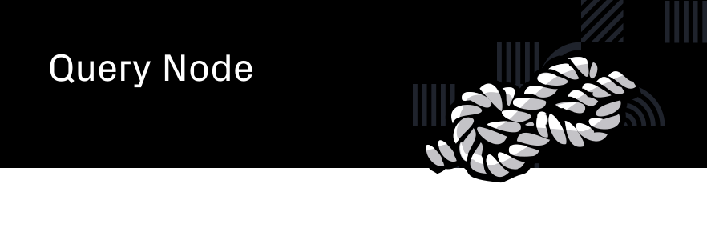

This is the work-in-progress version of the query node defined by the proposal at https://github.com/Joystream/joystream/issues/17. The query node acts as an GraphQL layer between Substrate full node RPC APIs and end-user applications that integrate with a Substrate chain. It's a decentralised API for the JoyStream ecosystem.

# Concept

Substrate has a web API framework - [Polkadot.js](https://github.com/polkadot-js/) - which can access all declared storage via a full node. It's powerful and easy to use, but it requires all non-SRML data types to be stored as TypeScript (or JavaScript) code that must be manually updated to support runtime migrations.  

The query node is an on-chain solution to this problem. It allows module developers to register all their data types in a dedicated _query module_, which is consumed by the query node. All chain data can then be queried by developers building integrating applications via an automatically-generated GraphQL schema. The storage for the module can be updated during a runtime upgrade, ensuring that the query node will always be up to date.

Additionally, the query node is designed to support developer-centric abstractions on the Substrate storage schema in the form of _custom queries_. These represent specific data requests that would be hard or impossible to infer from the module storage, or that would be liable to break when then the module storage changes during a runtime migration. Custom queries fit seamlessly into the GraphQL schema, and are stored on-chain as WebAssembly binaries.

# Work in progress

The query node is in a very early stage of development, and it may remain unstable for some time. A reference implementation for the custom queries and the toolkit used to create them can be found in the [query resolver toolkit](https://github.com/Joystream/query-resolver-toolkit) repository.

# Running the query node

## Requirements

### Yarn

This project uses [yarn](https://yarnpkg.com/) as Node package manager. It also
uses some node packages with native components, so make sure to install your
system's basic build tools.

On Debian-based systems:

```bash
$ apt install build-essential
```

On Mac OS (using [homebrew](https://brew.sh/)):

```bash
$ brew install libtool automake autoconf
```

### An archive node

## Setting up

There is a first-time installer that needs to be run once:

```bash
$ make install
```

This will configure the dev environment and build the applications. It will take quite a long time!

## Start the joystream testnet

The query node needs to connect to a full node. A testnet node is provided in this
repo, and can be started with:

```bash
$ make testnet
```

## Run the query node

```bash
$ make query-node
```

This will connect to the a full node on the localhost by default.

## Development run

```bash
$ make query-node-dev
```

This will connect to the a full node on the localhost by default. `make testnet` provides a
suitable archive node.

## Regenerating config interfaces

This could be necessary if the structure of the config JSON files changes.

```bash
$ make regenerate-config

```
